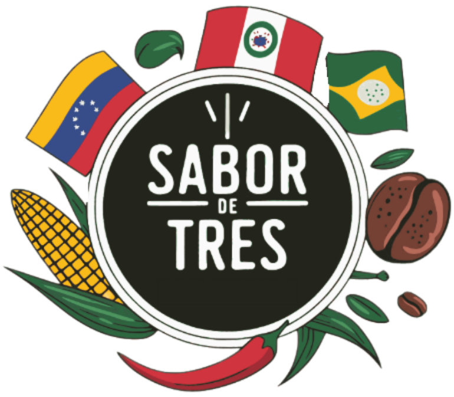

# 🍕 Sabor de Tres - Landing Page

Landing page moderna y responsive para **Sabor de Tres**, una empresa venezolana especializada en panadería artesanal y pizzas.



## 📋 Descripción

Esta landing page fue diseñada para mostrar los productos y servicios de Sabor de Tres, incluyendo:
- Panadería artesanal venezolana (golfeados, cachitos, tequeños)
- Pizzas personalizables
- Productos destacados
- Información de contacto y redes sociales

## 🚀 Características

- ✨ Diseño moderno y atractivo con glassmorphism
- 📱 Totalmente responsive (móvil, tablet, desktop)
- 🎨 Animaciones suaves y efectos hover
- 🌙 Esquema de colores premium
- 📄 Menús descargables en PDF
- 🖼️ Galería de productos con imágenes de alta calidad
- 📞 Botones de acción directos (WhatsApp, Instagram)

## 🛠️ Tecnologías Utilizadas

- **HTML5** - Estructura semántica
- **CSS3** - Estilos modernos con variables CSS, flexbox y grid
- **JavaScript (Vanilla)** - Interactividad y funcionalidad
- **Google Fonts** - Tipografía Poppins

## 📁 Estructura del Proyecto

```
sabordetres-lp/
├── assets/
│   ├── bg-products.png          # Fondo de la sección de productos
│   ├── cardapio.pdf             # Menú de panadería
│   ├── destaque.jpg             # Imagen destacada
│   ├── golfeados-product.png    # Producto golfeados
│   ├── hero-bg.png              # Imagen de fondo del hero
│   ├── logo.png                 # Logo de Sabor de Tres
│   ├── monte_do_seu_jeito.png   # Imagen de personalización
│   ├── pizzas-cardapio.pdf      # Menú de pizzas
│   ├── product-paes.jpg         # Imagen de panes
│   └── product-pizza.jpg        # Imagen de pizzas
├── index.html                    # Página principal
├── style.css                     # Estilos CSS
├── script.js                     # JavaScript
└── README.md                     # Este archivo
```

## 🎯 Secciones de la Página

### 1. **Navbar**
- Logo de la empresa
- Links de navegación (Início, Produtos, Contato)
- Botón CTA de contacto

### 2. **Hero Section**
- Título principal atractivo
- Descripción breve del negocio
- Llamado a la acción principal
- Imagen de fondo impactante

### 3. **Productos Destacados**
- Tarjetas de productos con imágenes
- Descripciones breves
- Precios
- Botones de acción

### 4. **Galería de Productos**
- Sección de panadería con menú descargable
- Sección de pizzas con menú descargable
- Imágenes representativas

### 5. **CTA "Monte do seu Jeito"**
- Llamado a la acción para personalización
- Botón directo a WhatsApp

### 6. **Footer**
- Información de contacto
- Links a redes sociales
- Horarios de atención
- Copyright

## 🚀 Cómo Usar

### Visualización Local

1. Clona el repositorio:
```bash
git clone https://github.com/TU_USUARIO/sabordetres-lp.git
```

2. Navega al directorio:
```bash
cd sabordetres-lp
```

3. Abre el archivo `index.html` en tu navegador preferido:
   - Doble clic en el archivo, o
   - Usa un servidor local (recomendado):
   ```bash
   # Con Python 3
   python -m http.server 8000
   
   # Con Node.js (http-server)
   npx http-server
   ```

4. Visita `http://localhost:8000` en tu navegador

### Despliegue

Puedes desplegar esta landing page en diferentes plataformas:

#### **GitHub Pages**
1. Ve a la configuración de tu repositorio en GitHub
2. En la sección "Pages", selecciona la rama `main` o `master`
3. Tu sitio estará disponible en `https://TU_USUARIO.github.io/sabordetres-lp`

#### **Netlify**
1. Conecta tu repositorio de GitHub
2. Configura el build (no es necesario para HTML estático)
3. Despliega automáticamente

#### **Vercel**
1. Importa tu proyecto desde GitHub
2. Vercel detectará automáticamente que es un sitio estático
3. Despliega con un clic

## 🎨 Personalización

### Colores
Los colores se definen en variables CSS en `style.css`:
```css
:root {
    --primary-color: #ff6b35;
    --secondary-color: #f7931e;
    --dark-bg: #1a1a2e;
    --card-bg: rgba(255, 255, 255, 0.95);
}
```

### Contenido
- **Textos**: Edita el archivo `index.html`
- **Imágenes**: Reemplaza los archivos en la carpeta `assets/`
- **Estilos**: Modifica `style.css`
- **Funcionalidad**: Ajusta `script.js`

### Información de Contacto
Actualiza los siguientes datos en `index.html`:
- Número de WhatsApp
- Usuario de Instagram
- Dirección
- Horarios

## 📱 Responsive Design

La página está optimizada para:
- 📱 **Móviles**: < 768px
- 📱 **Tablets**: 768px - 1024px
- 💻 **Desktop**: > 1024px

## 🤝 Contribuciones

Las contribuciones son bienvenidas. Para cambios importantes:
1. Fork el proyecto
2. Crea una rama para tu feature (`git checkout -b feature/AmazingFeature`)
3. Commit tus cambios (`git commit -m 'Add some AmazingFeature'`)
4. Push a la rama (`git push origin feature/AmazingFeature`)
5. Abre un Pull Request

## 📄 Licencia

Este proyecto está bajo la Licencia MIT. Ver el archivo `LICENSE` para más detalles.

## 👥 Autor

**Sabor de Tres**
- Instagram: [@sabordetres.ve](https://instagram.com/sabordetres.ve)
- WhatsApp: [Contactar](https://wa.me/YOUR_NUMBER)

## 🙏 Agradecimientos

- Diseño inspirado en las mejores prácticas de web design moderno
- Fuentes tipográficas de Google Fonts
- Iconos y elementos visuales originales

---

⭐️ Si te gusta este proyecto, ¡dale una estrella en GitHub!
